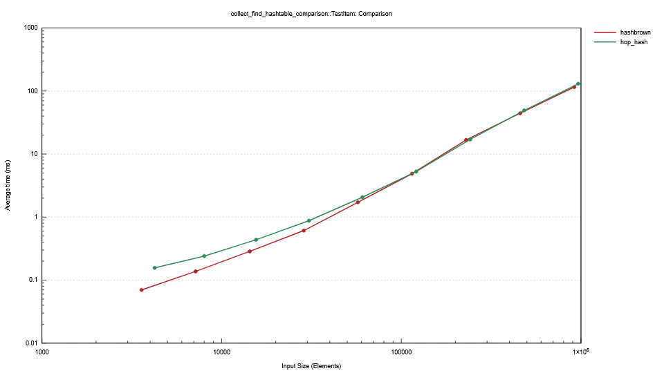
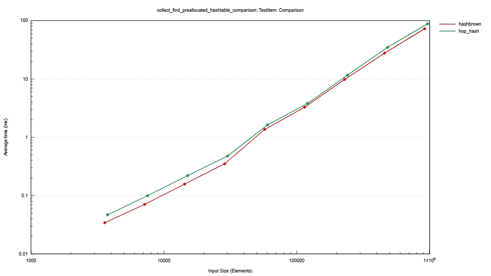
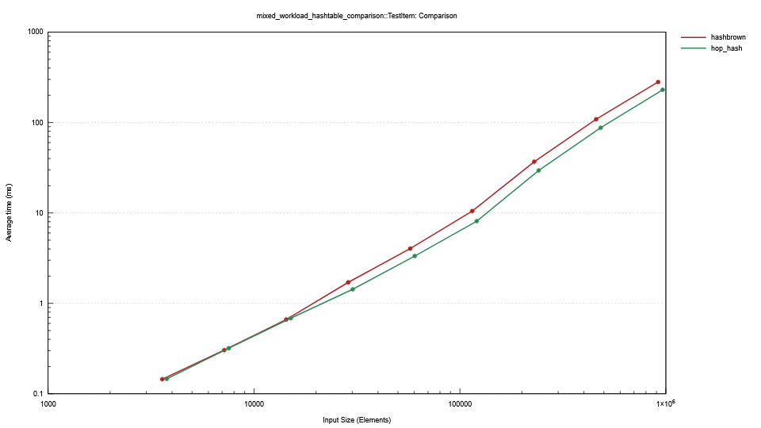
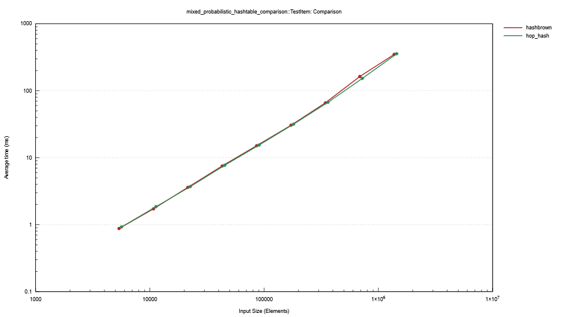
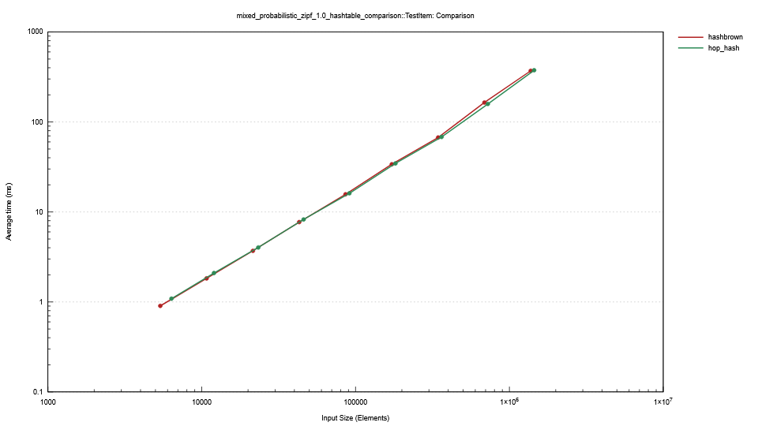
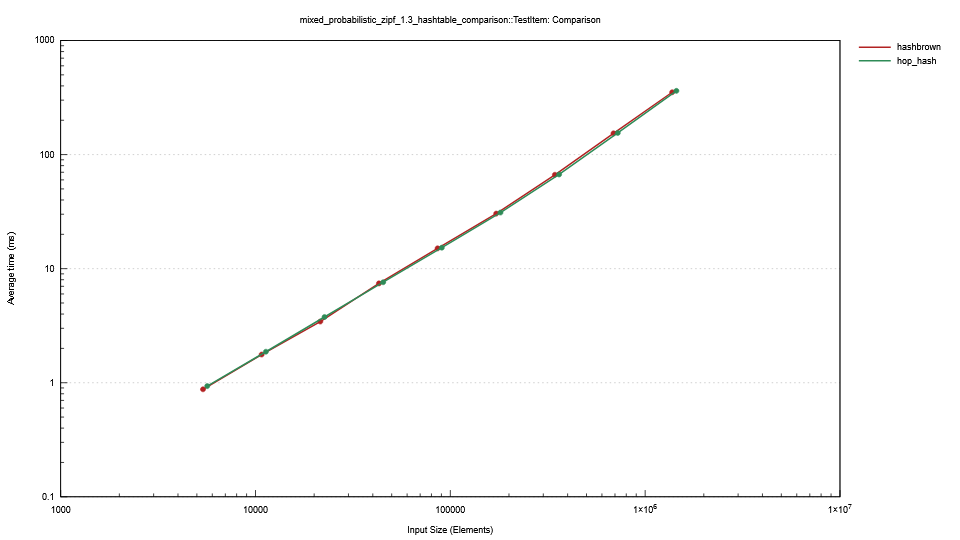
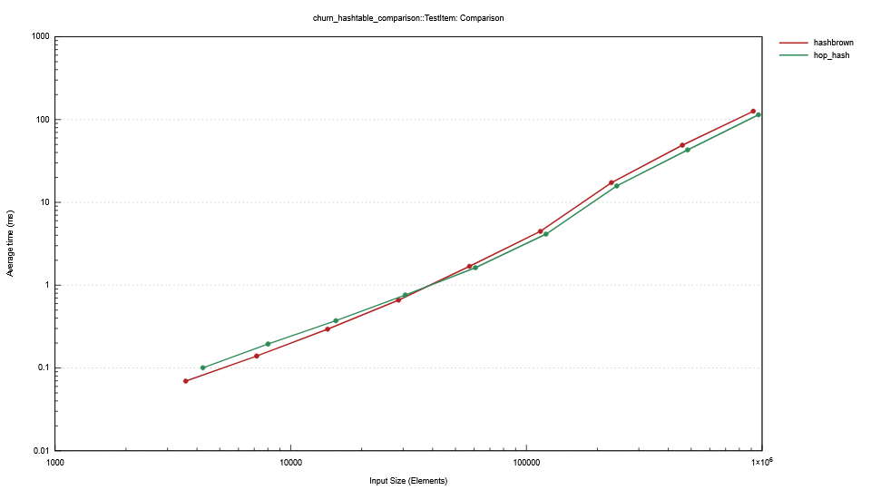
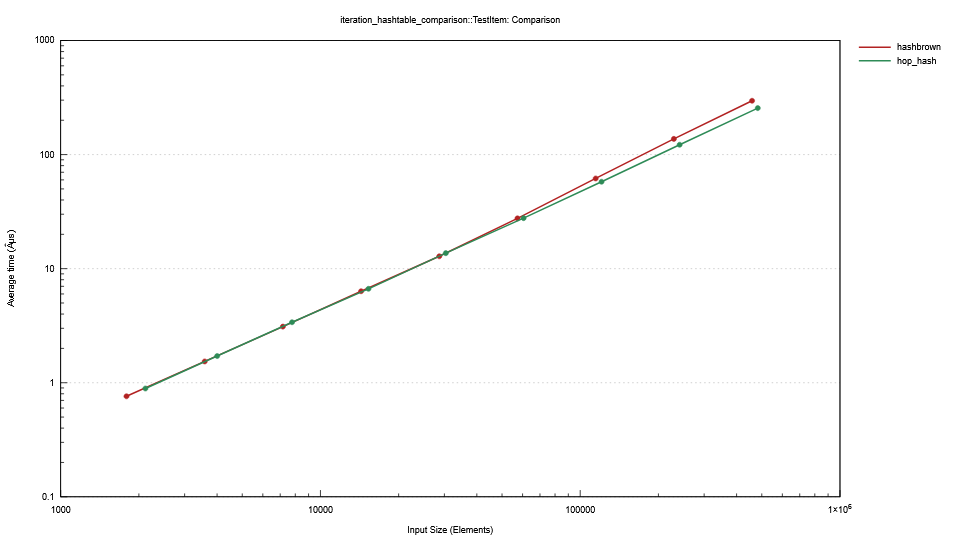
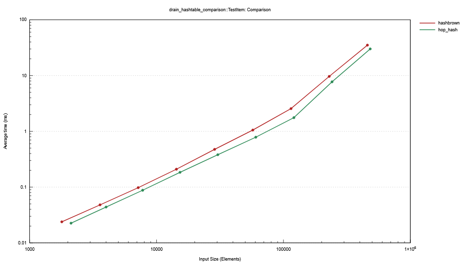

# Benchmark Results
## Key Takeaways
- Hop-hash performs well vs Hashbrown for mixed workloads sometimes outperforming it for large
  tables.
- Hop-hash significantly underperforms Hashbrown for single-operation workloads (get-only or insert-only).
- Drain performance is better than Hashbrown.

## Individual Result Graphs

In all cases, Hashbrown is represented with the red line, and Hop-hash is represented with the green line.

- CPU: AMD Ryzen AI 9 HX 370
- RAM: 32GB
- OS: Windows 11
- Rust Version: 1.89.0 (29483883e 2025-08-04)
- Default release profile
- Default features
- SipHash hasher
- Value-type (32 bytes) is a String of length 20, generated arbitrarily, plus a u64. The String is
  used as the key for hashing and comparisons.
  - Data is pre-generated for a benchmark and then used for all iterations of that benchmark. The
    initial data is pre-hashed before any insertion/find/etc. to try to exclude hashing time from
    the benchmarks as much as possible (some rehashing still occurs during table growth, but this
    seems like a fair thing to benchmark).
  - The benchmark suite does include large (280 bytes)/small (8 byte) value types, but those charts
    are not shown here for brevity. In general, the _relative_ performance of Hop-hash decreases for
    small value types, and increases for large value types.
- Run in Windows safe mode without networking to reduce background noise, pinned to a single CPU
  core, with realtime priority. A script was used to automate re-running benchmarks until the
  results had a run-to-run variance under 5% and total variance in one direction across 3 runs of
  under 5%.

### Mixed Workloads
#### Collect/Find
The following benchmark results show the performance of hop-hash vs hashbrown for a mixed workload
which:
- Inserts up to the target capacity & load factor, so the table is full
- Looks up all of the original elements (all hits)

This is an extremely common workload for hash tables, and hashbrown definitely has the advantage here.

#### Insert/Remove/Get/Insert Mix
The following benchmark results show the performance of hop-hash vs hashbrown for a mixed workload
which:
- Inserts up to the target capacity & load factor, so the table is full
- Removes half of the items in the table
- Looks up all of the original elements (half will be misses)
- Inserts up to the target capacity and load factor again

#### Find/Insert/Remove Mix (50/25/25)
The following benchmark results show the performance of hop-hash vs hashbrown for a mixed workload
which randomizes between find, insert, and remove operations in a 50/25/25 ratio.

#### Find/Insert/Remove Mix Zipf 1.0/1.3
The following benchmark results show the performance of hop-hash vs hashbrown for a mixed workload
which randomizes between find, insert, and remove operations using a zipf distribution with s=1.0
and s=1.3.

#### Churn
This benchmark simulates a workload where the table is kept at a steady state, with random inserts
and removals. A batch of items equal to 2x the target capacity is allocated, then iterated over in
random order. If an item is not in the table already, it is inserted. If it is already in the table,
it is removed. 

### Single Operation Workloads
#### Iteration
The following benchmark results show the performance of hop-hash vs hashbrown for iterating over
all items in the table.

#### Drain
The following benchmark results show the performance of hop-hash vs hashbrown for draining all
items from the table.

## Selected Result Tables

Values are based on the median point estimate recorded by Criterion.

Keep in mind while reviewing these results that benchmarks on my machine can vary by 5% between
runs.

### Benchmark: `churn` | Item Type: `LargeTestItem`

| Size  | hashbrown | hop_hash  | Comparison                        |
| ----- | --------- | --------- | --------------------------------- |
| 1024  | 63 ns/op  | 71 ns/op  | **hashbrown** is **1.12x** faster |
| 2048  | 90 ns/op  | 79 ns/op  | **hop_hash** is **1.14x** faster  |
| 4096  | 135 ns/op | 85 ns/op  | **hop_hash** is **1.59x** faster  |
| 8192  | 138 ns/op | 97 ns/op  | **hop_hash** is **1.41x** faster  |
| 16384 | 197 ns/op | 135 ns/op | **hop_hash** is **1.46x** faster  |
| 32768 | 223 ns/op | 156 ns/op | **hop_hash** is **1.43x** faster  |

### Benchmark: `churn` | Item Type: `TestItem`

| Size   | hashbrown | hop_hash  | Comparison                        |
| ------ | --------- | --------- | --------------------------------- |
| 1024   | 19 ns/op  | 21 ns/op  | **hashbrown** is **1.08x** faster |
| 2048   | 19 ns/op  | 21 ns/op  | **hashbrown** is **1.08x** faster |
| 4096   | 21 ns/op  | 22 ns/op  | **hashbrown** is **1.06x** faster |
| 8192   | 23 ns/op  | 24 ns/op  | **hashbrown** is **1.04x** faster |
| 16384  | 29 ns/op  | 27 ns/op  | **hop_hash** is **1.09x** faster  |
| 32768  | 39 ns/op  | 38 ns/op  | **hop_hash** is **1.01x** faster  |
| 65536  | 75 ns/op  | 66 ns/op  | **hop_hash** is **1.15x** faster  |
| 131072 | 107 ns/op | 90 ns/op  | **hop_hash** is **1.19x** faster  |
| 262144 | 137 ns/op | 120 ns/op | **hop_hash** is **1.15x** faster  |

### Benchmark: `collect_find` | Item Type: `LargeTestItem`

| Size  | hashbrown | hop_hash  | Comparison                        |
| ----- | --------- | --------- | --------------------------------- |
| 1024  | 48 ns/op  | 53 ns/op  | **hashbrown** is **1.10x** faster |
| 2048  | 92 ns/op  | 88 ns/op  | **hop_hash** is **1.04x** faster  |
| 4096  | 141 ns/op | 124 ns/op | **hop_hash** is **1.14x** faster  |
| 8192  | 151 ns/op | 139 ns/op | **hop_hash** is **1.09x** faster  |
| 16384 | 193 ns/op | 162 ns/op | **hop_hash** is **1.19x** faster  |
| 32768 | 218 ns/op | 181 ns/op | **hop_hash** is **1.21x** faster  |

### Benchmark: `collect_find` | Item Type: `TestItem`

| Size   | hashbrown | hop_hash  | Comparison                        |
| ------ | --------- | --------- | --------------------------------- |
| 1024   | 19 ns/op  | 24 ns/op  | **hashbrown** is **1.25x** faster |
| 2048   | 19 ns/op  | 24 ns/op  | **hashbrown** is **1.28x** faster |
| 4096   | 19 ns/op  | 24 ns/op  | **hashbrown** is **1.22x** faster |
| 8192   | 21 ns/op  | 25 ns/op  | **hashbrown** is **1.22x** faster |
| 16384  | 30 ns/op  | 32 ns/op  | **hashbrown** is **1.06x** faster |
| 32768  | 41 ns/op  | 42 ns/op  | **hashbrown** is **1.02x** faster |
| 65536  | 70 ns/op  | 71 ns/op  | **hashbrown** is **1.02x** faster |
| 131072 | 99 ns/op  | 106 ns/op | **hashbrown** is **1.06x** faster |
| 262144 | 130 ns/op | 138 ns/op | **hashbrown** is **1.06x** faster |

### Benchmark: `collect_find_preallocated` | Item Type: `LargeTestItem`

| Size  | hashbrown | hop_hash  | Comparison                        |
| ----- | --------- | --------- | --------------------------------- |
| 1024  | 44 ns/op  | 44 ns/op  | **hashbrown** is **1.01x** faster |
| 2048  | 92 ns/op  | 97 ns/op  | **hashbrown** is **1.06x** faster |
| 4096  | 89 ns/op  | 99 ns/op  | **hashbrown** is **1.12x** faster |
| 8192  | 87 ns/op  | 94 ns/op  | **hashbrown** is **1.08x** faster |
| 16384 | 103 ns/op | 113 ns/op | **hashbrown** is **1.10x** faster |
| 32768 | 118 ns/op | 130 ns/op | **hashbrown** is **1.10x** faster |

### Benchmark: `collect_find_preallocated` | Item Type: `TestItem`

| Size   | hashbrown | hop_hash | Comparison                        |
| ------ | --------- | -------- | --------------------------------- |
| 1024   | 11 ns/op  | 12 ns/op | **hashbrown** is **1.11x** faster |
| 2048   | 11 ns/op  | 13 ns/op | **hashbrown** is **1.20x** faster |
| 4096   | 12 ns/op  | 14 ns/op | **hashbrown** is **1.18x** faster |
| 8192   | 12 ns/op  | 15 ns/op | **hashbrown** is **1.24x** faster |
| 16384  | 24 ns/op  | 26 ns/op | **hashbrown** is **1.12x** faster |
| 32768  | 28 ns/op  | 31 ns/op | **hashbrown** is **1.09x** faster |
| 65536  | 40 ns/op  | 46 ns/op | **hashbrown** is **1.14x** faster |
| 131072 | 61 ns/op  | 71 ns/op | **hashbrown** is **1.17x** faster |
| 262144 | 79 ns/op  | 93 ns/op | **hashbrown** is **1.18x** faster |

### Benchmark: `drain` | Item Type: `LargeTestItem`

| Size  | hashbrown | hop_hash | Comparison                        |
| ----- | --------- | -------- | --------------------------------- |
| 1024  | 21 ns/op  | 25 ns/op | **hashbrown** is **1.19x** faster |
| 2048  | 30 ns/op  | 35 ns/op | **hashbrown** is **1.16x** faster |
| 4096  | 25 ns/op  | 30 ns/op | **hashbrown** is **1.20x** faster |
| 8192  | 25 ns/op  | 43 ns/op | **hashbrown** is **1.69x** faster |
| 16384 | 49 ns/op  | 43 ns/op | **hop_hash** is **1.15x** faster  |
| 32768 | 86 ns/op  | 61 ns/op | **hop_hash** is **1.41x** faster  |

### Benchmark: `drain` | Item Type: `TestItem`

| Size   | hashbrown | hop_hash | Comparison                       |
| ------ | --------- | -------- | -------------------------------- |
| 1024   | 13 ns/op  | 11 ns/op | **hop_hash** is **1.24x** faster |
| 2048   | 13 ns/op  | 11 ns/op | **hop_hash** is **1.22x** faster |
| 4096   | 14 ns/op  | 11 ns/op | **hop_hash** is **1.25x** faster |
| 8192   | 15 ns/op  | 12 ns/op | **hop_hash** is **1.26x** faster |
| 16384  | 17 ns/op  | 12 ns/op | **hop_hash** is **1.41x** faster |
| 32768  | 18 ns/op  | 13 ns/op | **hop_hash** is **1.38x** faster |
| 65536  | 22 ns/op  | 15 ns/op | **hop_hash** is **1.46x** faster |
| 131072 | 42 ns/op  | 32 ns/op | **hop_hash** is **1.30x** faster |
| 262144 | 77 ns/op  | 67 ns/op | **hop_hash** is **1.14x** faster |

### Benchmark: `iteration` | Item Type: `LargeTestItem`

| Size  | hashbrown  | hop_hash   | Comparison                       |
| ----- | ---------- | ---------- | -------------------------------- |
| 1024  | 1.36 ns/op | 0.42 ns/op | **hop_hash** is **3.27x** faster |
| 2048  | 1.36 ns/op | 0.44 ns/op | **hop_hash** is **3.08x** faster |
| 4096  | 1.36 ns/op | 0.46 ns/op | **hop_hash** is **2.98x** faster |
| 8192  | 1.36 ns/op | 0.48 ns/op | **hop_hash** is **2.83x** faster |
| 16384 | 1.37 ns/op | 0.51 ns/op | **hop_hash** is **2.67x** faster |
| 32768 | 1.37 ns/op | 0.55 ns/op | **hop_hash** is **2.49x** faster |

### Benchmark: `iteration` | Item Type: `TestItem`

| Size   | hashbrown  | hop_hash   | Comparison                        |
| ------ | ---------- | ---------- | --------------------------------- |
| 1024   | 0.42 ns/op | 0.40 ns/op | **hop_hash** is **1.05x** faster  |
| 2048   | 0.43 ns/op | 0.40 ns/op | **hop_hash** is **1.08x** faster  |
| 4096   | 0.43 ns/op | 0.44 ns/op | **hashbrown** is **1.02x** faster |
| 8192   | 0.44 ns/op | 0.45 ns/op | **hashbrown** is **1.02x** faster |
| 16384  | 0.45 ns/op | 0.48 ns/op | **hashbrown** is **1.07x** faster |
| 32768  | 0.48 ns/op | 0.50 ns/op | **hashbrown** is **1.05x** faster |
| 65536  | 0.54 ns/op | 0.53 ns/op | **hop_hash** is **1.01x** faster  |
| 131072 | 0.60 ns/op | 0.55 ns/op | **hop_hash** is **1.08x** faster  |
| 262144 | 0.65 ns/op | 0.56 ns/op | **hop_hash** is **1.14x** faster  |

### Benchmark: `mixed_probabilistic` | Item Type: `LargeTestItem`

| Size  | hashbrown | hop_hash  | Comparison                       |
| ----- | --------- | --------- | -------------------------------- |
| 1024  | 436 ns/op | 399 ns/op | **hop_hash** is **1.09x** faster |
| 2048  | 442 ns/op | 411 ns/op | **hop_hash** is **1.08x** faster |
| 4096  | 451 ns/op | 409 ns/op | **hop_hash** is **1.10x** faster |
| 8192  | 463 ns/op | 419 ns/op | **hop_hash** is **1.11x** faster |
| 16384 | 491 ns/op | 436 ns/op | **hop_hash** is **1.13x** faster |
| 32768 | 529 ns/op | 464 ns/op | **hop_hash** is **1.14x** faster |

### Benchmark: `mixed_probabilistic` | Item Type: `TestItem`

| Size   | hashbrown | hop_hash  | Comparison                        |
| ------ | --------- | --------- | --------------------------------- |
| 1024   | 167 ns/op | 168 ns/op | **hashbrown** is **1.01x** faster |
| 2048   | 167 ns/op | 170 ns/op | **hashbrown** is **1.02x** faster |
| 4096   | 169 ns/op | 170 ns/op | **hashbrown** is **1.01x** faster |
| 8192   | 180 ns/op | 171 ns/op | **hop_hash** is **1.05x** faster  |
| 16384  | 179 ns/op | 174 ns/op | **hop_hash** is **1.03x** faster  |
| 32768  | 202 ns/op | 177 ns/op | **hop_hash** is **1.14x** faster  |
| 65536  | 217 ns/op | 187 ns/op | **hop_hash** is **1.16x** faster  |
| 131072 | 245 ns/op | 209 ns/op | **hop_hash** is **1.17x** faster  |
| 262144 | 276 ns/op | 246 ns/op | **hop_hash** is **1.12x** faster  |

### Benchmark: `mixed_probabilistic_zipf_1.0` | Item Type: `LargeTestItem`

| Size  | hashbrown | hop_hash  | Comparison                       |
| ----- | --------- | --------- | -------------------------------- |
| 1024  | 430 ns/op | 413 ns/op | **hop_hash** is **1.04x** faster |
| 2048  | 439 ns/op | 422 ns/op | **hop_hash** is **1.04x** faster |
| 4096  | 452 ns/op | 418 ns/op | **hop_hash** is **1.08x** faster |
| 8192  | 460 ns/op | 426 ns/op | **hop_hash** is **1.08x** faster |
| 16384 | 485 ns/op | 444 ns/op | **hop_hash** is **1.09x** faster |
| 32768 | 510 ns/op | 455 ns/op | **hop_hash** is **1.12x** faster |

### Benchmark: `mixed_probabilistic_zipf_1.0` | Item Type: `TestItem`

| Size   | hashbrown | hop_hash  | Comparison                       |
| ------ | --------- | --------- | -------------------------------- |
| 1024   | 168 ns/op | 165 ns/op | **hop_hash** is **1.02x** faster |
| 2048   | 170 ns/op | 169 ns/op | **hop_hash** is **1.01x** faster |
| 4096   | 172 ns/op | 170 ns/op | **hop_hash** is **1.01x** faster |
| 8192   | 179 ns/op | 172 ns/op | **hop_hash** is **1.04x** faster |
| 16384  | 183 ns/op | 173 ns/op | **hop_hash** is **1.05x** faster |
| 32768  | 197 ns/op | 176 ns/op | **hop_hash** is **1.12x** faster |
| 65536  | 195 ns/op | 191 ns/op | **hop_hash** is **1.02x** faster |
| 131072 | 239 ns/op | 214 ns/op | **hop_hash** is **1.11x** faster |
| 262144 | 269 ns/op | 245 ns/op | **hop_hash** is **1.10x** faster |

### Benchmark: `mixed_probabilistic_zipf_1.3` | Item Type: `LargeTestItem`

| Size  | hashbrown | hop_hash  | Comparison                       |
| ----- | --------- | --------- | -------------------------------- |
| 1024  | 427 ns/op | 409 ns/op | **hop_hash** is **1.04x** faster |
| 2048  | 446 ns/op | 414 ns/op | **hop_hash** is **1.08x** faster |
| 4096  | 445 ns/op | 415 ns/op | **hop_hash** is **1.07x** faster |
| 8192  | 462 ns/op | 423 ns/op | **hop_hash** is **1.09x** faster |
| 16384 | 480 ns/op | 442 ns/op | **hop_hash** is **1.09x** faster |
| 32768 | 505 ns/op | 458 ns/op | **hop_hash** is **1.10x** faster |

### Benchmark: `mixed_probabilistic_zipf_1.3` | Item Type: `TestItem`

| Size   | hashbrown | hop_hash  | Comparison                        |
| ------ | --------- | --------- | --------------------------------- |
| 1024   | 168 ns/op | 165 ns/op | **hop_hash** is **1.02x** faster  |
| 2048   | 167 ns/op | 171 ns/op | **hashbrown** is **1.03x** faster |
| 4096   | 170 ns/op | 169 ns/op | **hop_hash** is **1.01x** faster  |
| 8192   | 178 ns/op | 171 ns/op | **hop_hash** is **1.04x** faster  |
| 16384  | 181 ns/op | 173 ns/op | **hop_hash** is **1.05x** faster  |
| 32768  | 184 ns/op | 178 ns/op | **hop_hash** is **1.04x** faster  |
| 65536  | 194 ns/op | 187 ns/op | **hop_hash** is **1.04x** faster  |
| 131072 | 224 ns/op | 212 ns/op | **hop_hash** is **1.06x** faster  |
| 262144 | 250 ns/op | 245 ns/op | **hop_hash** is **1.02x** faster  |

### Benchmark: `mixed_probabilistic_zipf_1.8` | Item Type: `LargeTestItem`

| Size  | hashbrown | hop_hash  | Comparison                       |
| ----- | --------- | --------- | -------------------------------- |
| 1024  | 428 ns/op | 408 ns/op | **hop_hash** is **1.05x** faster |
| 2048  | 447 ns/op | 415 ns/op | **hop_hash** is **1.08x** faster |
| 4096  | 446 ns/op | 418 ns/op | **hop_hash** is **1.07x** faster |
| 8192  | 463 ns/op | 425 ns/op | **hop_hash** is **1.09x** faster |
| 16384 | 478 ns/op | 427 ns/op | **hop_hash** is **1.12x** faster |
| 32768 | 502 ns/op | 458 ns/op | **hop_hash** is **1.10x** faster |

### Benchmark: `mixed_probabilistic_zipf_1.8` | Item Type: `TestItem`

| Size   | hashbrown | hop_hash  | Comparison                        |
| ------ | --------- | --------- | --------------------------------- |
| 1024   | 164 ns/op | 165 ns/op | **hashbrown** is **1.01x** faster |
| 2048   | 164 ns/op | 164 ns/op | **hop_hash** is **1.00x** faster  |
| 4096   | 165 ns/op | 166 ns/op | **hashbrown** is **1.00x** faster |
| 8192   | 173 ns/op | 173 ns/op | **hop_hash** is **1.00x** faster  |
| 16384  | 176 ns/op | 172 ns/op | **hop_hash** is **1.02x** faster  |
| 32768  | 178 ns/op | 174 ns/op | **hop_hash** is **1.02x** faster  |
| 65536  | 193 ns/op | 185 ns/op | **hop_hash** is **1.04x** faster  |
| 131072 | 232 ns/op | 215 ns/op | **hop_hash** is **1.07x** faster  |
| 262144 | 251 ns/op | 244 ns/op | **hop_hash** is **1.03x** faster  |

### Benchmark: `mixed_workload` | Item Type: `LargeTestItem`

| Size  | hashbrown | hop_hash  | Comparison                       |
| ----- | --------- | --------- | -------------------------------- |
| 1024  | 166 ns/op | 84 ns/op  | **hop_hash** is **1.99x** faster |
| 2048  | 231 ns/op | 123 ns/op | **hop_hash** is **1.88x** faster |
| 4096  | 267 ns/op | 152 ns/op | **hop_hash** is **1.75x** faster |
| 8192  | 368 ns/op | 209 ns/op | **hop_hash** is **1.77x** faster |
| 16384 | 442 ns/op | 260 ns/op | **hop_hash** is **1.70x** faster |
| 32768 | 495 ns/op | 308 ns/op | **hop_hash** is **1.60x** faster |

### Benchmark: `mixed_workload` | Item Type: `TestItem`

| Size   | hashbrown | hop_hash  | Comparison                        |
| ------ | --------- | --------- | --------------------------------- |
| 1024   | 42 ns/op  | 43 ns/op  | **hashbrown** is **1.02x** faster |
| 2048   | 43 ns/op  | 43 ns/op  | **hop_hash** is **1.01x** faster  |
| 4096   | 47 ns/op  | 44 ns/op  | **hop_hash** is **1.06x** faster  |
| 8192   | 59 ns/op  | 46 ns/op  | **hop_hash** is **1.28x** faster  |
| 16384  | 71 ns/op  | 53 ns/op  | **hop_hash** is **1.35x** faster  |
| 32768  | 97 ns/op  | 70 ns/op  | **hop_hash** is **1.40x** faster  |
| 65536  | 160 ns/op | 118 ns/op | **hop_hash** is **1.36x** faster  |
| 131072 | 232 ns/op | 173 ns/op | **hop_hash** is **1.34x** faster  |
| 262144 | 288 ns/op | 230 ns/op | **hop_hash** is **1.26x** faster  |
