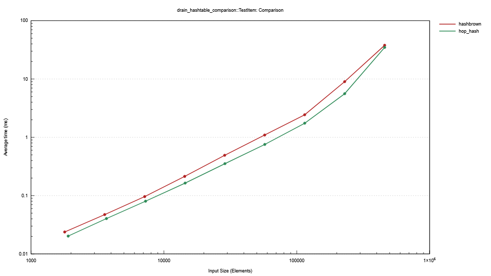

# Benchmark Results
## Key Takeaways
- Hop-hash performs well vs Hashbrown for mixed workloads while at a higher load factor (92%).
- Hop-hash significantly underperforms Hashbrown for single-operation workloads (get-only or insert-only).
- Iteration performance is better than Hashbrown.

## Individual Results

In all cases, Hashbrown is represented with the red line, and Hop-hash is represented with the green line.

- CPU: AMD Ryzen AI 9 HX 370
- RAM: 32GB
- OS: Windows 11
- Rust Version: 1.89.0 (29483883e 2025-08-04)
- Default release profile
- Default features
- SipHash hasher
- Value-type is a String of length 20, generated randomly + a u64. The String is used as the key for
  hashing and comparisons.
  - The benchmark suite does include large/small value types, but these are not shown here for
    brevity. In general, the _relative_ performance of Hop-hash decreases for small value types, and
    increases for large value types.

### Mixed Workloads
#### Collect/Find
The following benchmark results show the performance of hop-hash vs hashbrown for a mixed workload
which:
- Inserts up to the target capacity & load factor, so the table is full
- Looks up all of the original elements (all hits)

This is an extremely common workload for hash tables, and hashbrown definitely has the advantage here.

#### Insert/Remove/Get/Insert Mix
The following benchmark results show the performance of hop-hash vs hashbrown for a mixed workload
which:
- Inserts up to the target capacity & load factor, so the table is full
- Removes half of the items in the table
- Looks up all of the original elements (half will be misses)
- Inserts up to the target capacity and load factor again

#### Find/Insert/Remove Mix (50/25/25)
The following benchmark results show the performance of hop-hash vs hashbrown for a mixed workload
which randomizes between find, insert, and remove operations in a 50/25/25 ratio.

#### Find/Insert/Remove Mix Zipf 1.0/1.3
The following benchmark results show the performance of hop-hash vs hashbrown for a mixed workload
which randomizes between find, insert, and remove operations using a zipf distribution with s=1.0
and s=1.3.

#### Churn
This benchmark simulates a workload where the table is kept at a steady state, with random inserts
and removals. A batch of items equal to 2x the target capacity is allocated, then iterated over in
random order. If an item is not in the table already, it is inserted. If it is already in the table,
it is removed. 

### Single Operation Workloads
#### Iteration
The following benchmark results show the performance of hop-hash vs hashbrown for iterating over
all items in the table.

#### Drain
The following benchmark results show the performance of hop-hash vs hashbrown for draining all
items from the table.

## Selected Results Table:

O(Ops) is an _approximation_ of the number of operations performed. It is highly correlated with the
size of the map the operations are performed on, but is not exactly equal to it. This table is
generated after-the-fact from the benchmark results, and the exact table sizes aren't recorded in
the benchmarks, but the number of operations is.

Keep in mind while reviewing these results that benchmarks on my machine can vary by up to 5%
(although <3% is typical) between runs even though I'm running these on a quiet system. Also keep in
mind that hop-hash is running at a load factor of 92%, while hashbrown is running at a load factor
of 87.5%.

| Benchmark                    | Test Item     |  O(Ops) |    hashbrown |     hop_hash | Relative Performance |
| ---------------------------- | ------------- | ------: | -----------: | -----------: | -------------------- |
| Churn                        | TestItem      |    4096 |  18.15 ns/op |  18.75 ns/op | 0.97x                |
| Churn                        | TestItem      |    8192 |  19.98 ns/op |  21.47 ns/op | 0.93x                |
| Churn                        | TestItem      |   16384 |  22.65 ns/op |  24.39 ns/op | 0.93x                |
| Churn                        | TestItem      |   32768 |  23.45 ns/op |  25.79 ns/op | 0.91x                |
| Churn                        | TestItem      |   65536 |  29.96 ns/op |  29.02 ns/op | 1.03x                |
| Churn                        | TestItem      |  131072 |  47.29 ns/op |  42.12 ns/op | 1.12x                |
| Churn                        | TestItem      |  262144 |  90.57 ns/op |  77.51 ns/op | 1.17x                |
| Churn                        | TestItem      |  524288 | 120.26 ns/op | 104.76 ns/op | 1.15x                |
| Churn                        | TestItem      | 1048576 | 145.87 ns/op | 141.16 ns/op | 1.03x                |
| 
                        |               |         |              |              |                      |
| Collect Find                 | TestItem      |    2048 |  35.02 ns/op |  39.88 ns/op | 0.88x                |
| Collect Find                 | TestItem      |    4096 |  36.57 ns/op |  44.85 ns/op | 0.82x                |
| Collect Find                 | TestItem      |    8192 |  40.55 ns/op |  47.80 ns/op | 0.85x                |
| Collect Find                 | TestItem      |   16384 |  43.53 ns/op |  49.89 ns/op | 0.87x                |
| Collect Find                 | TestItem      |   32768 |  59.53 ns/op |  67.72 ns/op | 0.88x                |
| Collect Find                 | TestItem      |   65536 |  81.11 ns/op |  86.29 ns/op | 0.94x                |
| Collect Find                 | TestItem      |  131072 | 159.80 ns/op | 146.54 ns/op | 1.09x                |
| Collect Find                 | TestItem      |  262144 | 201.23 ns/op | 226.99 ns/op | 0.89x                |
| Collect Find                 | TestItem      |  524288 | 269.92 ns/op | 279.03 ns/op | 0.97x                |
| 
                        |               |         |              |              |                      |
| Collect Find                 | LargeTestItem |    2048 | 123.88 ns/op |  99.40 ns/op | 1.25x                |
| Collect Find                 | LargeTestItem |    4096 | 231.88 ns/op | 219.23 ns/op | 1.06x                |
| Collect Find                 | LargeTestItem |    8192 | 280.67 ns/op | 246.94 ns/op | 1.14x                |
| Collect Find                 | LargeTestItem |   16384 | 299.86 ns/op | 266.13 ns/op | 1.13x                |
| Collect Find                 | LargeTestItem |   32768 | 382.52 ns/op | 324.24 ns/op | 1.18x                |
| Collect Find                 | LargeTestItem |   65536 | 452.89 ns/op | 386.61 ns/op | 1.17x                |
| 
                        |               |         |              |              |                      |
| Collect Find Preallocated    | TestItem      |    2048 |  21.48 ns/op |  25.81 ns/op | 0.83x                |
| Collect Find Preallocated    | TestItem      |    4096 |  20.68 ns/op |  26.80 ns/op | 0.77x                |
| Collect Find Preallocated    | TestItem      |    8192 |  23.22 ns/op |  34.58 ns/op | 0.67x                |
| Collect Find Preallocated    | TestItem      |   16384 |  26.69 ns/op |  36.74 ns/op | 0.73x                |
| Collect Find Preallocated    | TestItem      |   32768 |  47.33 ns/op |  52.50 ns/op | 0.90x                |
| Collect Find Preallocated    | TestItem      |   65536 |  55.81 ns/op |  77.78 ns/op | 0.72x                |
| Collect Find Preallocated    | TestItem      |  131072 |  95.87 ns/op | 111.13 ns/op | 0.86x                |
| Collect Find Preallocated    | TestItem      |  262144 | 139.33 ns/op | 157.90 ns/op | 0.88x                |
| Collect Find Preallocated    | TestItem      |  524288 | 168.71 ns/op | 187.89 ns/op | 0.90x                |
| 
                        |               |         |              |              |                      |
| Collect Find Preallocated    | LargeTestItem |    2048 |  79.75 ns/op | 112.30 ns/op | 0.71x                |
| Collect Find Preallocated    | LargeTestItem |    4096 | 175.47 ns/op | 209.28 ns/op | 0.84x                |
| Collect Find Preallocated    | LargeTestItem |    8192 | 175.35 ns/op | 216.77 ns/op | 0.81x                |
| Collect Find Preallocated    | LargeTestItem |   16384 | 176.39 ns/op | 217.92 ns/op | 0.81x                |
| Collect Find Preallocated    | LargeTestItem |   32768 | 204.84 ns/op | 244.48 ns/op | 0.84x                |
| Collect Find Preallocated    | LargeTestItem |   65536 | 255.43 ns/op | 302.75 ns/op | 0.84x                |
| 
                        |               |         |              |              |                      |
| Drain                        | TestItem      |    2048 |  13.29 ns/op |  11.34 ns/op | 1.17x                |
| Drain                        | TestItem      |    4096 |  13.62 ns/op |  11.20 ns/op | 1.22x                |
| Drain                        | TestItem      |    8192 |  14.05 ns/op |  11.70 ns/op | 1.20x                |
| Drain                        | TestItem      |   16384 |  14.97 ns/op |  12.23 ns/op | 1.22x                |
| Drain                        | TestItem      |   32768 |  16.00 ns/op |  12.16 ns/op | 1.32x                |
| Drain                        | TestItem      |   65536 |  17.64 ns/op |  12.76 ns/op | 1.38x                |
| Drain                        | TestItem      |  131072 |  23.23 ns/op |  15.42 ns/op | 1.51x                |
| Drain                        | TestItem      |  262144 |  48.55 ns/op |  33.98 ns/op | 1.43x                |
| Drain                        | TestItem      |  524288 |  81.42 ns/op |  67.28 ns/op | 1.21x                |
| 
                        |               |         |              |              |                      |
| Iteration                    | TestItem      |    2048 |   0.42 ns/op |   0.39 ns/op | 1.08x                |
| Iteration                    | TestItem      |    4096 |   0.44 ns/op |   0.39 ns/op | 1.11x                |
| Iteration                    | TestItem      |    8192 |   0.43 ns/op |   0.37 ns/op | 1.18x                |
| Iteration                    | TestItem      |   16384 |   0.44 ns/op |   0.36 ns/op | 1.23x                |
| Iteration                    | TestItem      |   32768 |   0.45 ns/op |   0.36 ns/op | 1.23x                |
| Iteration                    | TestItem      |   65536 |   0.49 ns/op |   0.37 ns/op | 1.32x                |
| Iteration                    | TestItem      |  131072 |   0.55 ns/op |   0.39 ns/op | 1.40x                |
| Iteration                    | TestItem      |  262144 |   0.60 ns/op |   0.41 ns/op | 1.47x                |
| Iteration                    | TestItem      |  524288 |   0.66 ns/op |   0.45 ns/op | 1.45x                |
| 
                        |               |         |              |              |                      |
| Mixed Probabilistic          | TestItem      |    8192 | 168.40 ns/op | 168.53 ns/op | 1.00x                |
| Mixed Probabilistic          | TestItem      |   16384 | 173.33 ns/op | 168.57 ns/op | 1.03x                |
| Mixed Probabilistic          | TestItem      |   32768 | 172.92 ns/op | 173.35 ns/op | 1.00x                |
| Mixed Probabilistic          | TestItem      |   65536 | 174.94 ns/op | 170.65 ns/op | 1.03x                |
| Mixed Probabilistic          | TestItem      |  131072 | 175.58 ns/op | 171.21 ns/op | 1.03x                |
| Mixed Probabilistic          | TestItem      |  262144 | 177.47 ns/op | 175.26 ns/op | 1.01x                |
| Mixed Probabilistic          | TestItem      |  524288 | 191.76 ns/op | 185.82 ns/op | 1.03x                |
| Mixed Probabilistic          | TestItem      | 1048576 | 236.89 ns/op | 211.27 ns/op | 1.12x                |
| Mixed Probabilistic          | TestItem      | 2097152 | 253.68 ns/op | 246.70 ns/op | 1.03x                |
| 
                        |               |         |              |              |                      |
| Mixed Probabilistic Zipf 1.0 | TestItem      |    8192 | 166.86 ns/op | 163.42 ns/op | 1.02x                |
| Mixed Probabilistic Zipf 1.0 | TestItem      |   16384 | 164.36 ns/op | 165.79 ns/op | 0.99x                |
| Mixed Probabilistic Zipf 1.0 | TestItem      |   32768 | 165.57 ns/op | 165.36 ns/op | 1.00x                |
| Mixed Probabilistic Zipf 1.0 | TestItem      |   65536 | 174.72 ns/op | 167.74 ns/op | 1.04x                |
| Mixed Probabilistic Zipf 1.0 | TestItem      |  131072 | 175.09 ns/op | 170.38 ns/op | 1.03x                |
| Mixed Probabilistic Zipf 1.0 | TestItem      |  262144 | 177.53 ns/op | 172.40 ns/op | 1.03x                |
| Mixed Probabilistic Zipf 1.0 | TestItem      |  524288 | 192.09 ns/op | 180.73 ns/op | 1.06x                |
| Mixed Probabilistic Zipf 1.0 | TestItem      | 1048576 | 239.26 ns/op | 221.58 ns/op | 1.08x                |
| Mixed Probabilistic Zipf 1.0 | TestItem      | 2097152 | 258.71 ns/op | 249.70 ns/op | 1.04x                |
| 
                        |               |         |              |              |                      |
| Mixed Probabilistic Zipf 1.3 | TestItem      |    8192 | 162.90 ns/op | 165.21 ns/op | 0.99x                |
| Mixed Probabilistic Zipf 1.3 | TestItem      |   16384 | 164.30 ns/op | 165.40 ns/op | 0.99x                |
| Mixed Probabilistic Zipf 1.3 | TestItem      |   32768 | 159.75 ns/op | 166.72 ns/op | 0.96x                |
| Mixed Probabilistic Zipf 1.3 | TestItem      |   65536 | 172.65 ns/op | 168.15 ns/op | 1.03x                |
| Mixed Probabilistic Zipf 1.3 | TestItem      |  131072 | 175.07 ns/op | 168.90 ns/op | 1.04x                |
| Mixed Probabilistic Zipf 1.3 | TestItem      |  262144 | 176.60 ns/op | 171.43 ns/op | 1.03x                |
| Mixed Probabilistic Zipf 1.3 | TestItem      |  524288 | 193.39 ns/op | 185.01 ns/op | 1.05x                |
| Mixed Probabilistic Zipf 1.3 | TestItem      | 1048576 | 223.08 ns/op | 213.92 ns/op | 1.04x                |
| Mixed Probabilistic Zipf 1.3 | TestItem      | 2097152 | 255.72 ns/op | 250.13 ns/op | 1.02x                |
| 
                        |               |         |              |              |                      |
| Mixed Probabilistic Zipf 1.8 | TestItem      |    8192 | 163.65 ns/op | 162.64 ns/op | 1.01x                |
| Mixed Probabilistic Zipf 1.8 | TestItem      |   16384 | 165.34 ns/op | 161.43 ns/op | 1.02x                |
| Mixed Probabilistic Zipf 1.8 | TestItem      |   32768 | 166.24 ns/op | 162.71 ns/op | 1.02x                |
| Mixed Probabilistic Zipf 1.8 | TestItem      |   65536 | 174.16 ns/op | 166.65 ns/op | 1.05x                |
| Mixed Probabilistic Zipf 1.8 | TestItem      |  131072 | 175.40 ns/op | 168.61 ns/op | 1.04x                |
| Mixed Probabilistic Zipf 1.8 | TestItem      |  262144 | 178.91 ns/op | 176.49 ns/op | 1.01x                |
| Mixed Probabilistic Zipf 1.8 | TestItem      |  524288 | 200.03 ns/op | 187.60 ns/op | 1.07x                |
| Mixed Probabilistic Zipf 1.8 | TestItem      | 1048576 | 230.09 ns/op | 217.34 ns/op | 1.06x                |
| Mixed Probabilistic Zipf 1.8 | TestItem      | 2097152 | 254.97 ns/op | 251.88 ns/op | 1.01x                |
| 
                        |               |         |              |              |                      |
| Mixed Workload               | TestItem      |    4096 |  40.43 ns/op |  38.66 ns/op | 1.05x                |
| Mixed Workload               | TestItem      |    8192 |  42.37 ns/op |  42.28 ns/op | 1.00x                |
| Mixed Workload               | TestItem      |   16384 |  46.20 ns/op |  45.43 ns/op | 1.02x                |
| Mixed Workload               | TestItem      |   32768 |  59.51 ns/op |  47.42 ns/op | 1.26x                |
| Mixed Workload               | TestItem      |   65536 |  70.30 ns/op |  55.33 ns/op | 1.27x                |
| Mixed Workload               | TestItem      |  131072 |  91.43 ns/op |  67.25 ns/op | 1.36x                |
| Mixed Workload               | TestItem      |  262144 | 160.65 ns/op | 122.19 ns/op | 1.31x                |
| Mixed Workload               | TestItem      |  524288 | 237.00 ns/op | 181.28 ns/op | 1.31x                |
| Mixed Workload               | TestItem      | 1048576 | 305.75 ns/op | 238.51 ns/op | 1.28x                |
